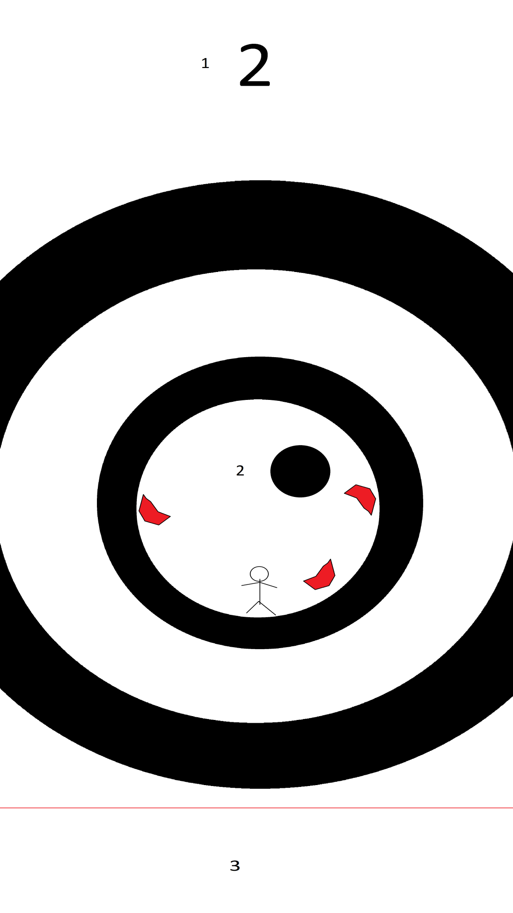

# Functional Design  
Orbis Runner is a run-and-jump platformer. The game is set on recursive, concentric circles, on which a variety of enemies pose the player with numerous challenges.  
It is going to have a whopping 20 levels with 3 kinds of enemies. The controls are touch based, and will be kept simplistic to make it an easy-to-approach game.  
We haven't decided on the sound track but that will surely make it's way into the game.  
  
## Starting Screen
  
From top to bottom  
1. Game title
2. Level  
3. Play button: Starts the game and has your character running around on the circle  
4. Customize button: You can change your character for coins here (colour and head-ware(?))
5. New Game: Reset your game  
6. Settings: Disable sounds/music, change the color palette, and a cheat mode for developers  
  
## Settings
Has toggles for sound and music, a reset button, and preferably a theme change option

## Gameplay

1. Level: Shows the current level that you are playing
2. Game: Shows the player and the obstacles, and preferably backdrop with the last level
3. Controls: A space where controls can be placed, if touch controls are unreasonable

## Death Screen
Shows you that you died and gives you the option to either retry the level or exit to the home screen.

## Music & Sounds
If we have time we will 'make' the music/sounds ourselves, else we will just steal them from online.

## Lore
Your name is Peter and you are collecting coins in a dangerous circle-like dungeon to buy medicine for your dying mother.  
After getting to the final level you hear a strange voice asking if you want to collect more coins, or if you want to go back to save your mother.  
Having felt the thrill of hundreds of near-death experiences, you forgot your purpose of adventuring these circles, and you are simply guided by your greed for coins.  
Thus, you continue to venture the dungeon for meaningless coins.

Instead of saving up coins for your dying mother, you instead buy colourful hats.

This is a romantic drama

## Manual/How to Play
When you start the game, it will begin by loading in the saved data (like custom levels, coin counter, changed to the settings, etc.). After the loading/splash screen you will be greeted by a simplistic starting screen with 5 buttons.
One button (the big one) takes you to the game screen. This button can be easily recognized by the big 'P L A Y' text that's inside of it. Then you also have the customize and shop button. The shop button will take you to the shop (obviously...). In the shop you can buy hats with the coins that you've collected. The hat you buy will automatically be selected, but if you wish to select a hat that you've purchased earlier, you can select it in the customize screen (which you can access by pressing the customize button).
In the customize screen you can also change the color of Peter. This is a form of cultural appreciation.
Then there's also the level select and the settings screen. In the level select you can select an unlocked level to play (duh). But you can also make and edit a level yourself. You can also delete your self-created levels.
In the settings you can turn off sound and/or music. The only music that plays is the background music when playing a level, and the only sound is the sound of when you die.
You can also reset the game in the settings, and open the about page for some information about the game.

In the game you can jump and 'duck', and win and die. To win you will have to either duck or jump with the precise timing. If you are unable to win and would like to complain to the developers, you can mail us at [Orbis Runner Mail](mailto:481909@student.saxion.nl?subject=[Orbis%20Runner]%20I%20Suck).

Press the left side of the screen to walk on the other side of the circle for some time, and press the right side to jump.
Ducking (walking on the other side) has a cooldown, so you can't spam this. You can see the cooldown time in the bottom left corner.
To jump higher you can hold the screen, and you can also hold the screen to fall slower.

