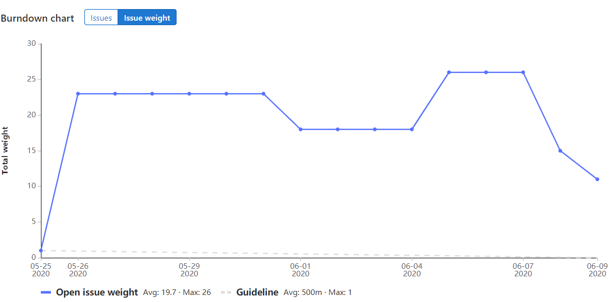
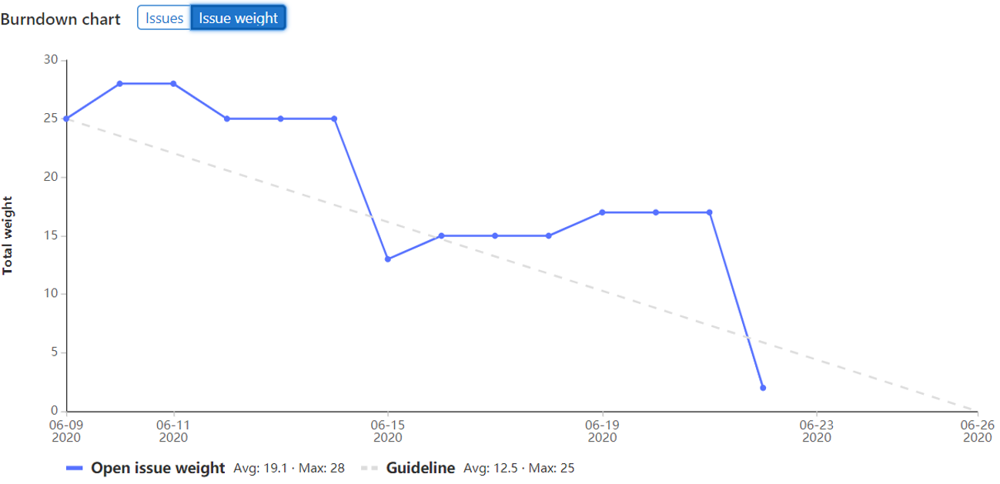

# Sprint 1
We started off with too many issues on our plate for the first sprint. We could not finish all the issues so five of the issues were pushed to the next sprint.  
The reason for this is because the weight of some issues were underestimated. For the next sprint we will take more caution when we decide the weight and the issues will be broken down into smaller pieces.
We treated the presentation more like a showcase than an actual presentation. Next time we will make a PowerPoint presentation. The roles will be divided.

The teamwork was excellent. Attendance was perfect, everyone was always present during the stand-ups and classes. The rules in the code of conduct were obeyed.

## Points
##### Unfinished issues
|Issue|Assignee|Reason|
|---|---|---|
|Settings screen|Joost|Bad planning  |
|Technical design|Serwet|Unclear, design was still being changed  |
|Entity sprites|Olaf| |
|W A L K I N animation|Olaf| |

#### What went wrong

- Issues were too big
- Presentation was too simple
- Excellent teamwork

#### Improvement for sprint 2
- Split large issues into smaller issues
- Properly prepare the presentation

# Sprint 2
The first week of the second sprint there was not much progress, namely because of the android retakes. So a few issues were left unfinished. This sprint we undervalued the weight of some issues yet again.
But we did finish all the issues from the last sprint and some of the most important issues in the second week of this sprint. One of the members of the group unfortunately caught the COVID-19 virus, so they were unable to finish their issues.

Our app is coming out nicely. Communication was great like the previous sprint.

## Points
##### Unfinished issues
|Issue|Assignee|Reason|
|---|---|---|
|Shop|Olaf| COVID-19 |
|Shopitem|Olaf|- |
|Logo|Olaf|- |
|W A L K I N animation|Olaf|- |
|Entity sprites|Olaf|- |
|Finish screen|Serwet| Dependent on GameActivity (was changed) |

#### What went wrong
- Issue weight too low
- Distracted by retakes
- Cleared sprint 1 backlog

#### Improvements for sprint 3
- More accurate issue weight
- Better planning (more deadlines than just the sprint due date)

# Sprint 3
The first week of the sprint we tried to finish as much as possible to make time for the other projects.
Progress in the second week was slow because of said projects.
For the final week we finished most of the app for the demonstration in the sprint review.
The presentation during the sprint review went very well. We prepared a PowerPoint presentation the day before.  
The team member with COVID-19 made a successful recovery so the team was reunited at last :).  
So teamwork went very well for the final sprint.

## Points
##### Unfinished issues
Nothing was unfinished

#### What went wrong
- Distracted by other projects
- Code became a bit unclear

#### Improvements next project
- Better planning
- More group meetings for programming not just stand-ups
- Make code more readable
