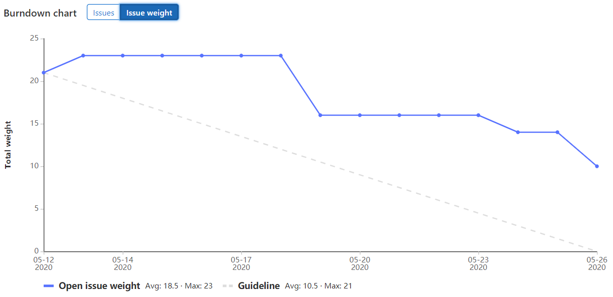

# Sprint 1
We started off with too many issues on our plate for the first sprint. We could not finish all the issues so five of the issues were pushed to the next sprint.  
The reason for this is because the weight of some issues were underestimated. For the next sprint we will take more caution when we decide the weight and the issues will be broken down into smaller pieces.
We treated the presentation more like a showcase than an actual presentation. Next time we will make a PowerPoint presentation. The roles will be divided.

The teamwork was excellent. Attendance was perfect, everyone was always present during the stand-ups and classes. The rules in the code of conduct were obeyed.

# Sprint 2
